# Djinni's Data Texts

A unified LDB DataText suite for World of Warcraft Retail (Midnight).
Works with any LDB display addon (ElvUI, Titan Panel, Bazooka, ChocolateBar, etc.).

## Summary

Djinni's Data Texts (DDT) provides 20 information-rich DataText modules covering social, character, economy, instance, time/location, and system categories. Each module features configurable label templates, tooltip sizing, click actions, and sort orders, all accessible through the Blizzard Settings interface.

DDT absorbs and replaces DjinnisGuildFriends, automatically migrating existing settings on first load.

## Features

- **20 DataText modules** covering every major information category
- **Configurable label templates** with `<tag>` syntax, clickable tag-insert buttons, and preset suggestions in settings
- **Global number formatting** with 8 locale presets (US, EU, French/SI, plain, custom) -- configurable thousands separator, decimal point, and abbreviation (k/m/b vs full numbers)
- **Configurable click actions** with 9 modifier combinations (Left, Right, Middle, Shift, Ctrl, Alt) on every module
- **Per-row click actions** on Currency, Bag Value, and Item Level tooltip rows (link to chat, open panels, search AH)
- **Auctionator category-filtered search** — Item Level enchant searches use the advanced filter format with slot subcategory and current expansion filter
- **Configurable tooltip sizing** (width, scale) per module
- **Configurable sort orders** on all list-based data
- **Optimized update loops** -- lightweight label-only updates when tooltip is hidden; heavy data collection gated behind tooltip visibility and dirty flags
- **Unified font system** (DDTFontHeader / DDTFontNormal / DDTFontSmall) with face and size configurable in General settings
- **Blizzard Settings API** integration with alphabetically sorted per-module subcategories
- **Consistent tooltip style** across all modules (dark background, gold headers, class-colored names, gray hint bar)
- **DjinnisGuildFriends migration** with automatic SavedVariables conversion and coexistence warning
- **LDB prefix**: `DDT-` (compatible with all LDB display addons)

## Modules

### Social (ported from DjinnisGuildFriends)

| Module | Description |
|--------|-------------|
| **Guild** | Online guild roster with MOTD, rank, zone, notes, officer notes. Grouped by rank/class/zone. |
| **Friends** | Character and Battle.net friends with game info, status, broadcasts. Filterable by type. |
| **Communities** | WoW Communities roster showing online members, role badges, M+ scores, and BNet App status. |

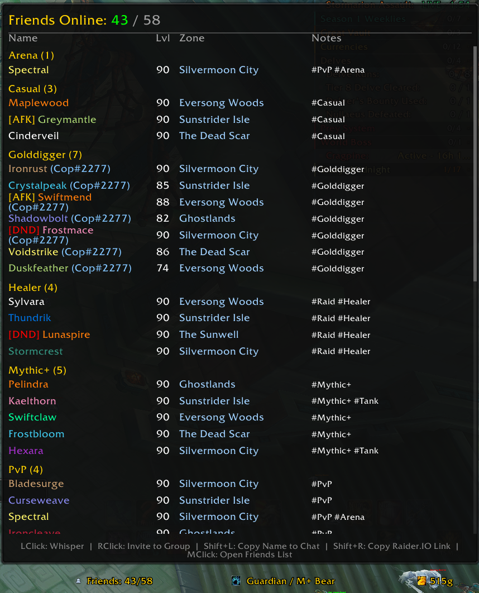 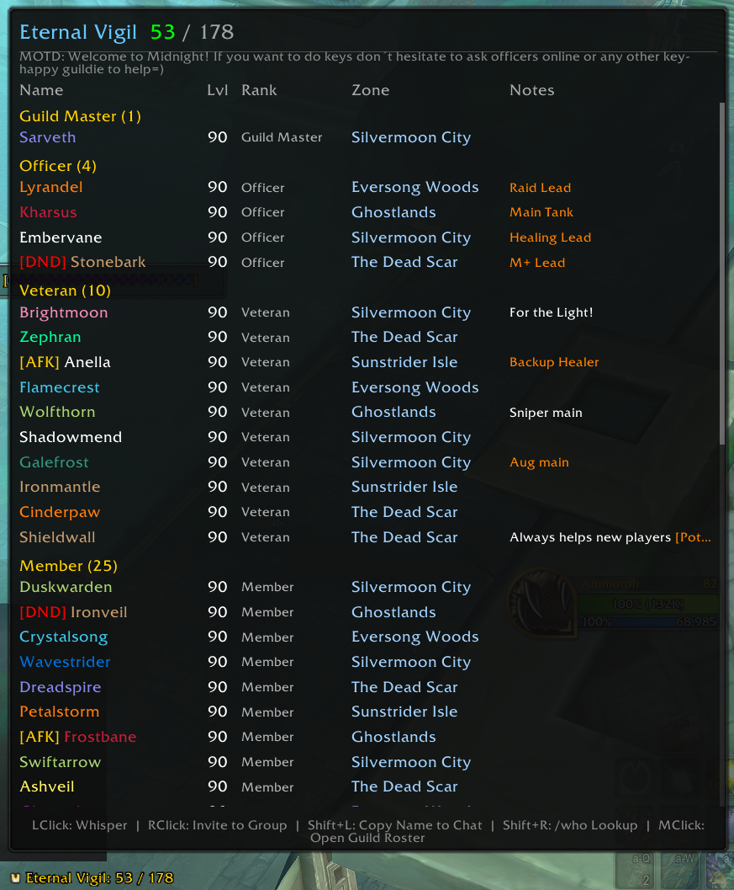 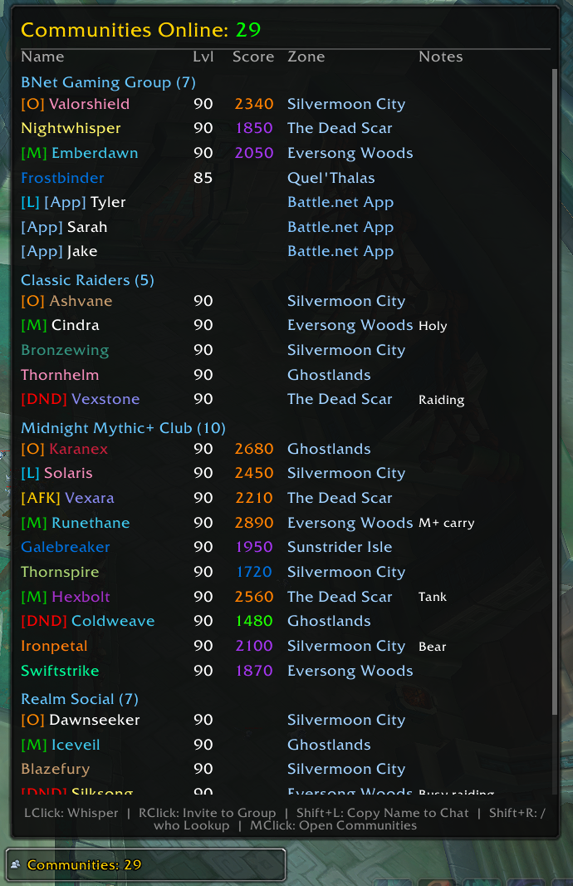

### Character & Stats

| Module | Description |
|--------|-------------|
| **Account Status** | At-a-glance warband bank access and pet journal unlock indicators for multiboxers. |
| **Character Info** | Name, realm, class, race, level, item level. Optional shard ID detection (opt-in). |
| **Experience** | XP bar with rested overlay, XP/hr tracking, quest XP sum, time-to-level estimate. Shows watched reputation at max level. |
| **Item Level** | Equipped item level and durability. Per-slot breakdown with quality colors, durability %, missing enchants/gems warnings. SimC string copy, Auctionator category-filtered shopping lists for missing enhancements, TSM search. AH gear upgrade search. |
| **Spec Switch** | Active spec, talent loadout switching, loot spec selection. Shows all specs with role icons and loadouts. |
| **Movement Speed** | Current/base speed as %, ground/fly/swim/skyriding speeds, active speed buff detection. Shopping list integration (Auctionator/TSM) for Midnight-era speed consumables. |

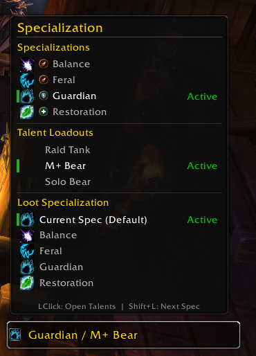 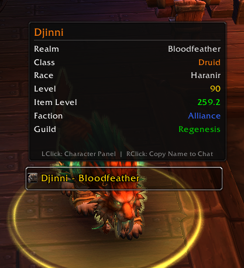 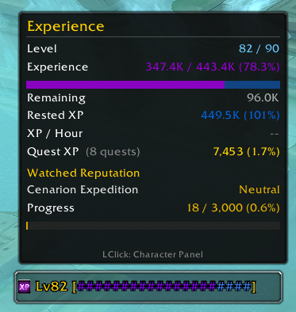 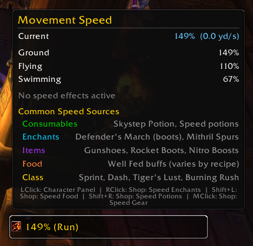

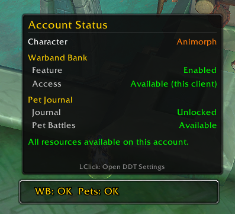 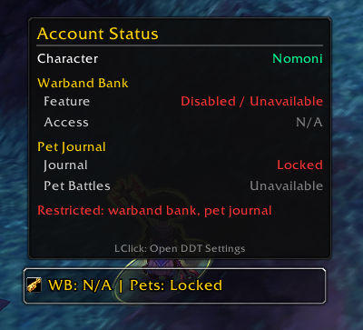

### Inventory & Economy

| Module | Description |
|--------|-------------|
| **Currency** | Character gold, alt gold totals, warband bank gold, WoW Token price, posted auction value. Expansion-grouped tracked currencies with icons and quality colors. |
| **Bag Value** | Total bag value via TSM price sources (6 sources) with vendor fallback. Top items breakdown, free/total slot display. |
| **Mail** | Unread mail indicator with full mailbox scan: sender, subject, money, attachments, expiry countdown. |

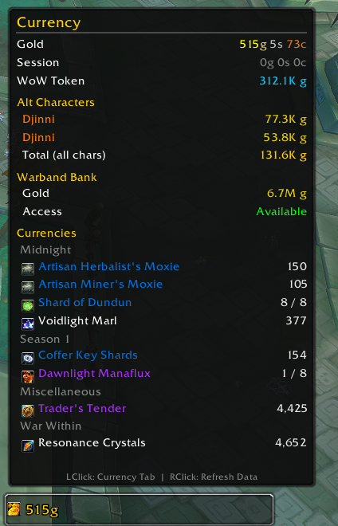 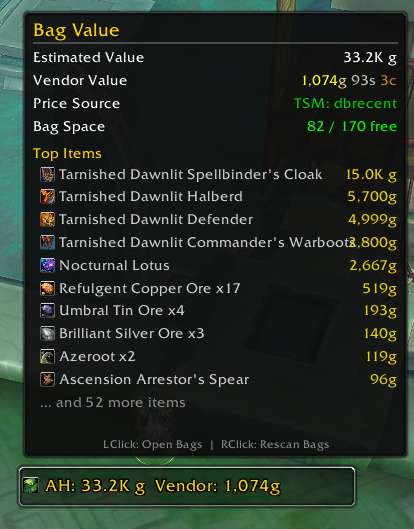 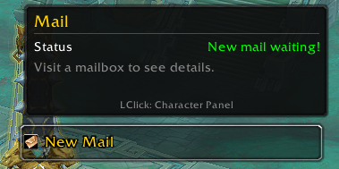

### Instances & Progress

| Module | Description |
|--------|-------------|
| **LFG Status** | Tracks LFG queue status (Dungeon/Raid Finder), premade group applications with role and status, and your listed group. Assigned role tracking shows which role you were accepted as. Live wait time and elapsed counters. Icon changes based on queue state. |
| **Saved Instances** | Raid and dungeon lockouts with boss kill status, M+ weekly runs, delve tracking with instance names and tiers. Difficulty color coding, extended lockout markers. Condensed views available. Alt lockouts via SavedInstances addon DB. Great Vault access on right-click. Column hover highlighting for improved alt data readability. |
| **Pet Info** | Pet journal unlock and battle capability status, collection stats (owned, level 25, rare quality, favorites). Click actions for revive, bandage, safari hat, treats, random summon. |

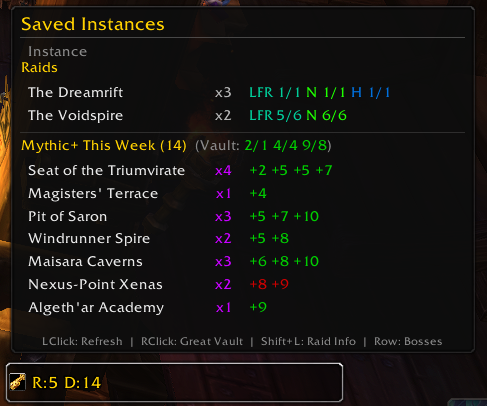 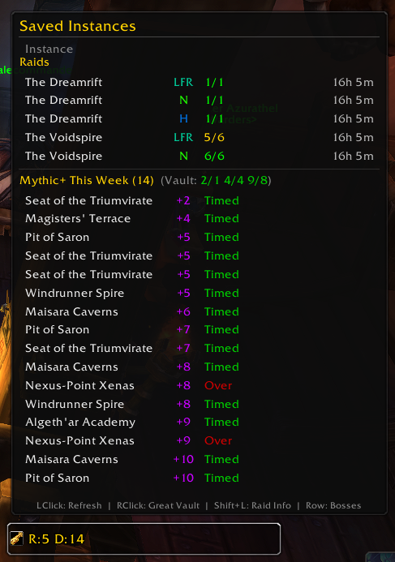 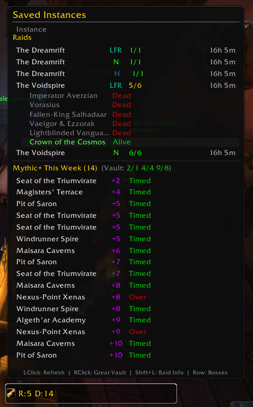

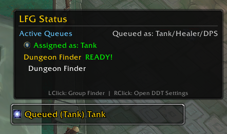 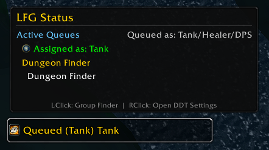 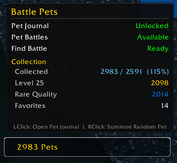

### Time & Location

| Module | Description |
|--------|-------------|
| **Time / Date** | Server and local time with 12h/24h toggle, seconds display. Daily and weekly reset countdowns. Calendar events and holidays. Configurable strftime date format with presets. |
| **Coordinates** | Player map coordinates via C_Map API. Zone, subzone, map name, map ID in tooltip. Click actions for world/zone map, coord copy, TomTom waypoint paste. |

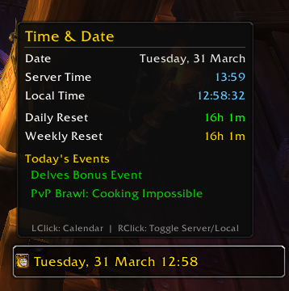 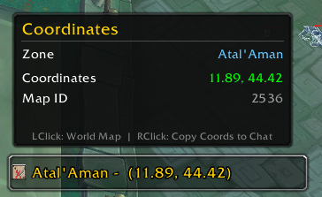

### System & Utility

| Module | Description |
|--------|-------------|
| **System Performance** | FPS, home/world latency, total addon memory with top consumers list. CPU profiler via C_AddOnProfiler API (per-addon CPU time, no scriptProfile cvar needed). |
| **Played Time** | Session timer, total /played time, level /played time. Class-colored character display. |
| **Micro Menu** | Quick-access clickable launcher for all game panels (character, spellbook, talents, achievements, collections, etc.). |

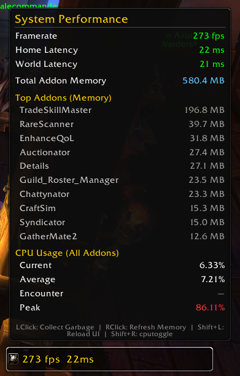

## Installation

1. Download or clone this repository into your WoW addons folder:
   ```
   World of Warcraft/_retail_/Interface/AddOns/DjinnisDataTexts/
   ```
2. If migrating from DjinnisGuildFriends, DDT will automatically import your settings on first load.
3. Configure via `/ddt` or the Blizzard Settings panel under **Djinni's Data Texts**.

## Configuration

All settings are accessible through the Blizzard Settings interface:

- **General** — Font face and size, number formatting (locale presets or custom separators/decimals/abbreviation)
- **Per-module subcategories** (alphabetically sorted) — Label template with tag buttons, tooltip scale/width, click actions, module-specific options

### Label Templates

Every module supports customizable LDB text via `<tag>` template syntax. Tags are module-specific (e.g., `<fps>`, `<gold>`, `<coords>`). The settings panel for each module provides clickable tag buttons for easy template building and 2-5 preset suggestions showing common configurations.

### Settings

  

 

### Click Actions

Every module supports configurable click actions across 9 modifier combinations: Left, Right, Middle, Shift+Left, Shift+Right, Ctrl+Left, Ctrl+Right, Alt+Left, Alt+Right. Available actions vary by module and are configured in each module's settings panel. Currency and Bag Value additionally support per-row click actions on their tooltip item rows.

## Dependencies

- **Required**: LibStub, CallbackHandler-1.0, LibDataBroker-1.1 (bundled)
- **Optional**: ElvUI (LDB display), TradeSkillMaster (bag value pricing, TSM shopping lists), SavedInstances (alt lockout data), Auctionator (shopping lists), SimulationCraft (ItemLevel SimC export), TomTom (waypoints)

## Slash Commands

- `/ddt` — Open the DDT settings panel

## SavedVariables

- `DjinnisDataTextsDB` — All module settings, alt gold data, per-character state

## Acknowledgements

- [DjinnisGuildFriends](https://github.com/Djinni-WoW/DjinnisGuildFriends) — Original social module codebase
- [ElvUI](https://github.com/tukui-org/ElvUI) — DataText patterns and tooltip conventions
- [Shadow & Light](https://www.tukui.org/addons.php?id=38) — Extended DataText ideas
- [WindTools](https://github.com/wind-addons/ElvUI_WindTools) — Additional DataText modules
- [EnhanceQoL](https://www.curseforge.com/wow/addons/enhanceqol) — System/performance DataText patterns
- [GreatVaultKeyInfo](https://www.curseforge.com/wow/addons/greatvaultkeyinfo) — Delve tracking inspiration
- [SavedInstances](https://www.curseforge.com/wow/addons/saved_instances) — Alt lockout data integration
- [TradeSkillMaster](https://www.tradeskillmaster.com/) — Bag value pricing and shopping list APIs
- [GoblinToolbox](https://github.com/user/GoblinToolbox) — Warband bank access patterns
- [Auctionator](https://www.curseforge.com/wow/addons/auctionator) — Shopping list API
- [SimulationCraft](https://www.simulationcraft.org/) — SimC string generation and addon export

## License

All rights reserved. This addon is provided as-is for personal use.
